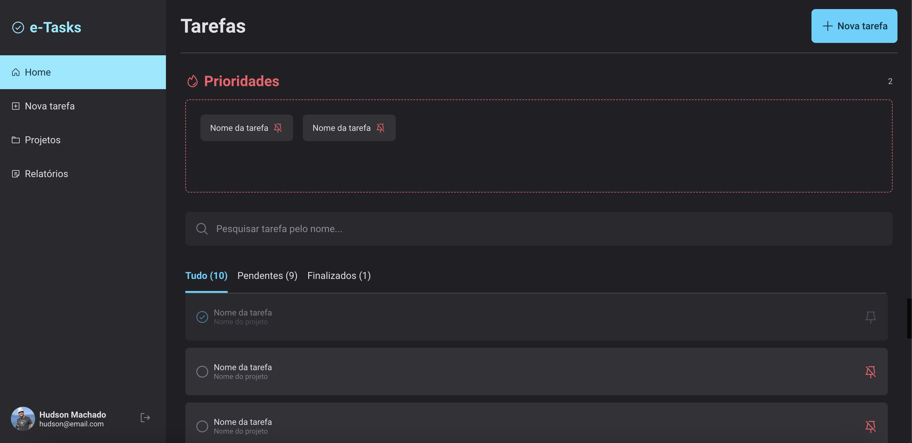

## 💻 Projeto

E-tasks é um projeto que foi desenvolvido exclusivamente para treinar responsividade com styled-components.

  

Conteúdo complementar do Explorer para trabalhar com responsividade.

  

 

  

